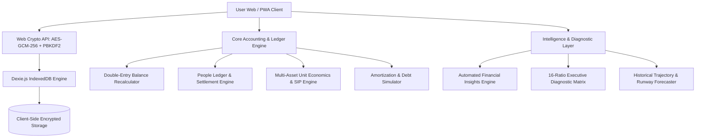

# 🏛️ KhataGHAR: Full A-to-Z Feature Architecture & Blueprint

KhataGHAR is an institutional-grade, zero-knowledge encrypted, local-first personal wealth operating system and double-entry ledger. It is engineered with zero cloud dependencies, complete privacy, strict mathematical precision, and standalone PWA offline execution.

---

## 📑 System Architecture Overview

---

## 1. 🔐 Security, Encryption & Vault Architecture

### 1.1 Zero-Knowledge Encryption Model
* **Algorithm**: Standard AES-GCM-256 (Galois/Counter Mode) with 128-bit authentication tag.
* **Key Derivation**: PBKDF2 (Password-Based Key Derivation Function 2) with HMAC-SHA-256 and **100,000 iterations**.
* **Salt Generation**: 16-byte cryptographically secure pseudorandom number generator (`crypto.getRandomValues`).
* **Session Key Lifecycle**: Held exclusively in volatile memory (`sessionStorage` / React State); keys are wiped instantly on browser close, reload, or lock.
* **Storage Invariant**: Plaintext financial data **never touches disk, local storage, or network sockets**. Only IV (12 bytes) + Ciphertext + Tag are written into IndexedDB.

### 1.2 Multi-Vault System
* **Isolated Vault Environments**: Create separate encrypted vaults for Personal, Business, Family, or Tax-specific entities within the same client.
* **Vault Switcher**: Rapid dropdown switcher in top header with password-protected vault activation.
* **Demo Sandbox Vault**:
  * 4-month simulated historical datasets covering equities, real estate, debts, and daily cashflows.
  * Interactive edit capability allowing users to test live double-entry balance recalculations.
  * Destructive guards preventing accidental permanent corruption.
  * Automatic purge on page reload to ensure visitors return cleanly to the Welcome Screen.

### 1.3 Offline Backup & Zero-Knowledge Restore
* **Format**: Standard `.khata` files containing encrypted payload envelopes with metadata headers.
* **Integrity Hashing**: SHA-256 checksum embedded to verify against transmission corruption or tampering.
* **Air-Gapped Portability**: Encrypted backup can be moved between offline machines without leaking passwords.

### 1.4 Privacy Shield Mode
* **1-Click Global Masking**: Press `P` or toggle the eye icon in the header to instantly mask all account balances, transaction figures, net worth values, and asset metrics with `••••••`.
* **Public Visibility Safe**: Ideal for using KhataGHAR in cafes, transit, or public screen shares.

---

## 2. 💳 Accounts & Double-Entry Ledger Engine

### 2.1 Supported Account Types
1. **Bank Accounts**: Savings and current accounts with institution tagging, account number mask, and branch routing.
2. **Cash In Hand**: Physical cash wallets and petty cash boxes.
3. **Credit Cards**:
   * Automatic negative balance handling (outstanding balance stored as liability debt).
   * Credit limit tracking, available credit utilization %, and billing cycle dates.
4. **Digital Wallets**: UPI/Prepaid wallets (Paytm, PhonePe, Amazon Pay, PayPal).

### 2.2 Strict Double-Entry Balance Integrity
* **Atomic Balance Adjustments**: Every inflow, outflow, and transfer adjusts balances synchronously.
* **IEEE-754 Precision Safeguards**: All monetary calculations rounded via `Math.round((num + Number.EPSILON) * 100) / 100` preventing floating-point rounding drifts.
* **Transaction Deletion Reversals**:
  * Deleting an expense automatically refunds the source account.
  * Deleting an income deducts the credited funds.
  * Deleting a transfer restores the source account and deducts the destination account.
* **Transaction Editing Delta Engine**:
  * Modifying amounts, source accounts, or types calculates the net delta between the old and new transaction, updating only accounts with non-zero differences.
* **Ledger Reconciliation Engine (`reconcileAccounts`)**:
  * One-click verification tool that replays every verified transaction, transfer, and people settlement from `initialBalance` to restore 100% mathematical precision.

---

## 3. 📝 Transactions & Quick Add Module

### 3.1 Five Transaction Modes
1. **Spend (Expense)**: Outflows attributed to categories and payment accounts.
2. **Income**: Salary, freelance, dividends, or interest credits.
3. **Transfer**: Intra-account funds movement between bank, wallet, and cash without creating fake expenses.
4. **Invest**: Capital allocation into Mutual Funds, SIPs, Stocks, or Gold holdings.
5. **Debt Payment**: Direct loan EMI or credit card debt reduction that debits bank and amortizes loan principal.

### 3.2 Smart Quick Add Features
* **Smart Amount Parsing**: Type `500`, `15k`, `2.5L`, or `1.2cr` with real-time conversion preview badge.
* **1-Tap Increment Pills**: Quick `+500`, `+1K`, `+2K`, `+5K`, `+10K` chips for effortless mobile entry.
* **Natural Category Wrapping**: Zero category truncation; category pills wrap naturally without vertical clipping.
* **Dynamic Note Placeholders**: Context-sensitive placeholders depending on whether you're logging an EMI, SIP, or grocery expense.
* **Tags & Search**: Hashtag attribution (`#personal`, `#tax`, `#vacation`) with instant tag search.
* **Recurring Automation**: Flag entries as Monthly, Weekly, or Yearly recurring transactions.

---

## 4. 🤝 People Ledger (Khata & Custodial Claims)

### 4.1 Relationship Types
* **Lent**: Money you provided to friends, family, or colleagues (Asset / Receivable).
* **Borrowed**: Loans taken from personal contacts (Liability / Payable).
* **Holding (Custodial)**: Funds entrusted to you for safekeeping or group pool management.

### 4.2 Account Linkage & Settlements
* **Bank Balance Synchronization**: Specifying an account when lending debits your bank; borrowing or holding credits your bank.
* **Partial Installment Settlements**: Record multiple partial repayments with dates and payment modes.
* **Overdue Tracking**: Automated due date monitoring with alerts in the Intelligence Hub.
* **Settlement Reversals**: Deleting people records automatically reverses principal and settlements from linked accounts.

---

## 5. 📈 Assets, Investments & SIP Lots Engine

### 5.1 Asset Classifications
* Real Estate / Property
* Vehicle Valuations
* Physical Gold / Sovereign Gold Bonds
* Fixed Deposits & Recurring Deposits (FD/RD)
* Equity Mutual Funds & SIPs
* Demat Direct Stocks
* EPF / PPF / National Pension System (NPS)
* Life Insurance Policies (ULIP / Endowment)
* Chit Funds & Alternative Holdings

### 5.2 Tranche & SIP Lots Architecture
* **Foundation Lot (Lot #1)**: Preserves original acquisition date, base cost, and initial block value.
* **Subsequent SIP Lots (Lot #2, #3...)**: Record periodic monthly installments, units purchased, and NAV.
* **Unit Economics**:
  * Real-time calculation of Total Units accumulated.
  * Average Acquisition Cost per Unit.
  * Latest Market NAV with one-click rapid NAV update tool.
* **Mathematical Gain % Accuracy**: Gain is computed against true cumulative cost (`initialCost + sum(SIP tranches)`), eliminating distorted returns.
* **Instant Dynamic Synchronization**: Adding or removing purchase tranches updates tables and return ratios in real time.

---

## 6. 🏛️ Liabilities & Debt Reduction Simulator

### 6.1 Debt Modeling
* Tracks Home Loans, Auto Loans, Personal Loans, Education Loans, and Credit Card Debt.
* Stores Principal Amount, Outstanding Balance, Annual APR Interest %, and Monthly EMI.

### 6.2 Debt Reduction & Prepayment Simulator
* Simulates lump-sum prepayments and extra monthly EMI contributions.
* Calculates total interest saved and reduction in loan tenure months.

---

## 7. 🎯 Budgets & Financial Goals

### 7.1 Category-Level Budgeting
* Monthly spending caps per category with visual progress meters.
* **Dynamic Warning Threshold**: Alerts at 85% utilization; highlights over-budget categories with exact excess amounts.
* **Rollover Support**: Unspent surplus can roll over to the subsequent month.

### 7.2 Milestone Goals
* Set targets for Emergency Funds, Vacations, Home Down Payments, or Vehicle Purchases.
* Tracks saved amounts, progress percentage, and target completion dates.

---

## 8. 📊 Executive Financial Dossier & 16-Ratio Diagnostics

### 8.1 16-Ratio Institutional Diagnostic Matrix
1. **Basic Liquidity Ratio**: Liquid cash vs monthly mandatory expenses.
2. **Savings Ratio**: Percentage of inflow saved and invested.
3. **Debt-to-Income (DTI)**: Total monthly debt obligations relative to gross income.
4. **Emergency Runway**: Number of months the household can survive on liquid reserves.
5. **Solvency Ratio**: Total net worth relative to total asset holdings.
6. **Debt-to-Asset Ratio**: Total liabilities compared against total asset base.
7. **Investment Assets Ratio**: Share of productive investment assets vs total assets.
8. **Asset Coverage Ratio**: Capital preservation buffer.
9. **Discretionary Spending Ratio**: Lifestyle expenses vs essential costs.
10. **Fixed Cost Ratio**: Overhead burden.
11. **Liquid Net Worth Ratio**: Pure cash/bank unencumbered net worth.
12. **Custodial Exposure Ratio**: Percentage of held funds.
13. **Credit Card Utilization**: Outstanding balance vs aggregate limits.
14. **Net Worth Growth Velocity**: Period-over-period net worth acceleration.
15. **Capital Allocation Efficiency**: Investment rate.
16. **Financial Health Composite Index**: Holistic 0–100 financial health benchmark.

### 8.2 Client-Side Export Engine
* **PDF Dossier**: Formats executive reports with auto-tables, cashflow breakdowns, and ratio cards.
* **CSV Export**: Clean spreadsheet dumps for Excel, LibreOffice, or chartered accountants.

---

## 9. 🧠 Living Financial Intelligence & Action Hub

### 9.1 Continuous Automated Audit Engine (`src/services/insights.ts`)
* Evaluates real vault data to flag:
  * Budget overruns with exact overage figures.
  * Negative bank balances to prevent overdraft fees.
  * Overdue personal claims and custodial holdings.
  * Upcoming planned bills due within 7 days.
  * High revolving credit card balances.
  * High-interest loans eligible for refinancing.

### 9.2 Dashboard Living Banner
* Displays primary critical issues with full text descriptions (no `+1 more` truncation).
* "Also Flagged" strip lists secondary issues with direct routing.
* One-click navigation to the dedicated **Financial Intelligence Hub** in Reports (`#/reports`).

---

## 10. 📱 Installable Standalone Offline PWA

* **Manifest V3 Compliant**: Configured via `vite-plugin-pwa` with standalone window display.
* **Service Worker Caching**: Workbox caching with 23 precached runtime assets.
* **Native Desktop & Mobile Support**:
  * Android & Windows: One-click native installation prompt.
  * iOS: Dedicated Safari Add-to-Home-Screen interactive walkthrough modal.
  * macOS: Standalone app window with custom app icon.
* **Full Offline Operation**: Zero internet required; loads instantaneously from device cache.

---

## 11. 🎨 UI System, Typography & Accessibility

* **Institutional Palette**: Moss, Pine, Ink, Card, Line, and Ground semantic color tokens.
* **Typography**: Dual display and monospace numeral formatting (`tabular-nums`) for currency columns.
* **Device-Aware Scaling**:
  * `125% zoom` for Welcome Landing & Vault Lock screens for high readability.
  * `105% zoom` for Main App Layout for balanced screen usage.
* **Spacious Desktop Modals**: Wide popups (`max-w-2xl` to `max-w-4xl`) on PC displays to prevent cramped fields and text collisions.
