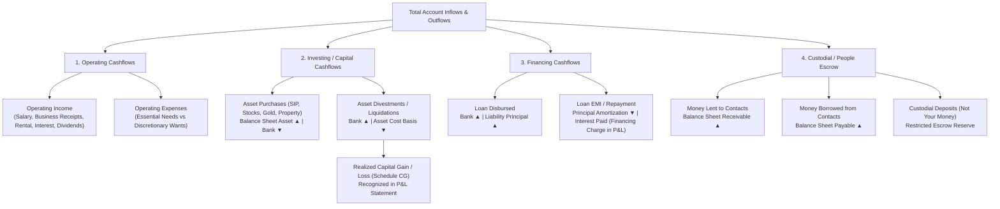
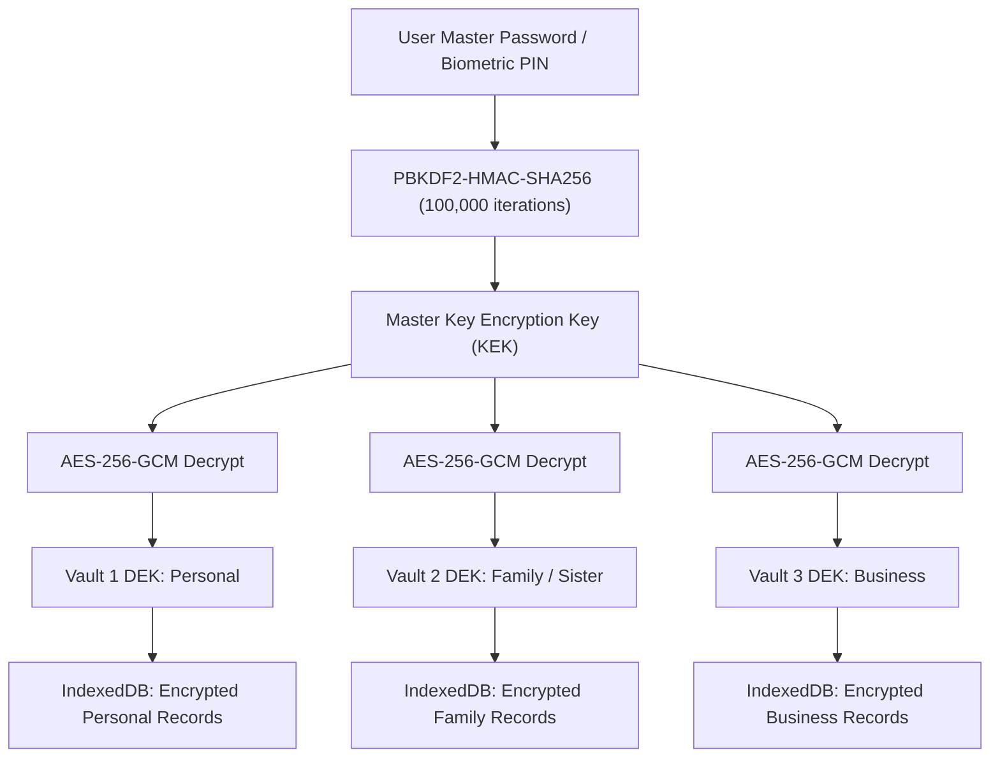

# 🏛️ KhataGHAR: Master Financial Architecture & Engineering Specification

> **Institutional-grade, zero-knowledge encrypted, local-first personal wealth operating system.**  
> *Engineered from the perspective of an advanced Chartered Accountant (CA), Chartered Financial Analyst (CFA), and Senior Systems Architect.*

---

## 📑 Executive Summary

Modern personal finance tools fail users at two extremes:
1. **Toy expense trackers**: They treat asset sales as arbitrary "income" or "expense", inflate cost bases, confuse cash movements with operational earnings, and distort net worth.
2. **Complex ERP/Accounting software (Tally, SAP, QuickBooks)**: They demand specialized double-entry bookkeeping knowledge, alienating everyday users with debits/credits confusion, manual voucher journals, and hostile interfaces.

**KhataGHAR bridges this gap.** Under the hood, it executes strict double-entry ledger mathematics, separates Operating Flows from Capital/Balance Sheet movements, isolates custodial escrow (People Ledger), calculates true realized capital gains (Schedule CG), and maps directly to Income Tax Return (ITR) schedules. On the surface, it provides a fluid, responsive, zero-cloud interface that feels effortless.

---

## 1. 📐 CA / CFA Financial Model & Accounting Foundations

KhataGHAR enforces strict classification between **Operating Activities**, **Investing Activities**, **Financing Activities**, and **Custodial / Fiduciary Movements**.



### 1.1 Gross Divestment vs Realized Capital Gain (The Core Divestment Fix)

#### The Problem
In rudimentary finance apps, selling ₹50,000 worth of mutual fund units is logged as `Income: ₹50,000`. This is mathematically and legally false:
- If the units originally cost ₹40,000, your true **Operating/Capital Income is only ₹10,000** (the Realized Gain).
- The remaining ₹40,000 is simply the return of your own capital (balance sheet asset converted to bank cash).
- Logging ₹50,000 as income artificially inflates your savings rate, distorts monthly earnings, and misleads tax planning.
- Worse, if the divestment is logged as a purchase lot, the asset holding's cost basis and unit count increase rather than decrease!

#### KhataGHAR's CA/CFA Standard Implementation
1. **Asset Divestment Tranches (`sellTranches`)**:
   - Liquidations are explicitly segregated from purchase lots (`buyTranches`).
   - Units redeemed and cost basis are subtracted proportionally from active holdings.
   - `currentUnits = Math.max(0, totalPurchasedUnits - totalRedeemedUnits)`
   - `currentCostBasis = Math.max(0, totalInvestedCost - totalRedeemedCost)`
2. **Realized Gain Calculation**:
   $$\text{Realized Capital Gain} = \text{Gross Sale Proceeds} - \text{Cost Basis of Units Sold}$$
   - If positive: Recognized as taxable capital profit in **Schedule CG (Capital Gains)** of the P&L statement.
   - If negative: Recognized as capital loss, available for carry-forward and set-off analysis under tax law.
3. **Full Liquidation Handling**:
   - When 100% of an asset is sold, its active invested capital and active units drop to **₹0.00**.
   - Rather than showing a false `-100.0% loss (-₹33.8k)` on the liquidated holding, KhataGHAR renders:
     `"Position Fully Liquidated (100% Redeemed)"` with total cumulative realized profit/loss and a Schedule CG audit trail.
4. **Transaction Journal Synchronization**:
   - Asset divestment transactions in the Transactions Journal prominently display both the gross cash proceeds deposited into your bank account AND the net realized capital gain pill:
     `+₹50,000` with `[📈 Gain: +₹10,000]` or `[📉 Loss: -₹2,500]`.

---

## 2. 📊 Institutional Profit & Loss (P&L) Statement Architecture

The KhataGHAR Reports section features a dedicated **Profit & Loss (P&L) Statement** built to Indian Accounting Standards (Ind AS) and ICAI guidelines, completely decoupled from non-revenue capital and custodial deposits.

### 2.1 Schedule-Wise Breakdown

| Schedule | Classification | Components Included | Excluded (Non-P&L) |
| :--- | :--- | :--- | :--- |
| **Schedule I** | **Operating Revenues** | Primary Salary, Professional Fees, Business Billings, Interest Income, Dividends, Rental Yields | Inter-account transfers, loan receipts, capital divestments, money borrowed/held for others |
| **Schedule II** | **Realized Capital Gains (Schedule CG)** | Equity/Mutual Fund short-term & long-term capital gains, gold sales, real estate gains | Unrealized mark-to-market fluctuations |
| **Schedule III** | **Operating Overhead & Consumption** | Split into **50/30/20 Rule**: <br>• **Essential Needs** (Rent, Groceries, Utilities, Healthcare, Insurance)<br>• **Discretionary Wants** (Dining, Entertainment, Shopping, Travel) | Asset investments (SIPs), loan principal repayments, money lent |
| **Metric** | **Operating Profit (EBITDA)** | $(\text{Sched I} + \text{Sched II}) - \text{Sched III}$ | Financing charges, tax provisioning |
| **Schedule IV** | **Financing Charges** | Interest paid on home loans, personal loans, credit card finance charges, processing fees | Principal loan amortization |
| **Bottom Line** | **Net Profit for the Period** | $\text{EBITDA} - \text{Sched IV}$ | Retained earnings transferred to Balance Sheet Net Worth |
| **Schedule V** | **Balance Sheet Memorandum** | Non-P&L Cashflows: Asset capital deployed (SIPs), Principal loan amortization, Net custodial people ledger flow | Operating revenues & consumption |

### 2.2 Income Tax Return (ITR) Reference Matrix

KhataGHAR provides instant estimates mapped to standard Indian tax filing schedules:

```
┌────────────────────────────────────────────────────────────────────────┐
│                      INCOME TAX SCHEDULE PREVIEW                       │
├──────────────────────────────┬──────────────────┬──────────────────────┤
│ ITR Head                     │ Indian Tax Code  │ KhataGHAR Source     │
├──────────────────────────────┼──────────────────┼──────────────────────┤
│ Income from Salary           │ Sec 15 - 17      │ Sched I: Salary Cat  │
│ Income from House Property   │ Sec 22 - 27      │ Sched I: Rental Cat  │
│ Capital Gains (STCG @ 20%)   │ Sec 111A         │ Sched II: Equity < 1y│
│ Capital Gains (LTCG @ 12.5%) │ Sec 112A         │ Sched II: Equity > 1y│
│ Income from Other Sources    │ Sec 56(2)        │ Sched I: Div / Int   │
└──────────────────────────────┴──────────────────┴──────────────────────┘
```

---

## 3. 👥 People Ledger & Custodial Escrow Architecture

The People Ledger tracks informal peer-to-peer lending, borrowing, and custodial money holding without contaminating the operating P&L.

```
       ┌─────────────────────────────────────────────────────────┐
       │                   PEOPLE LEDGER TYPES                   │
       └────────────────────────────┬────────────────────────────┘
                                    │
         ┌──────────────────────────┼──────────────────────────┐
         ▼                          ▼                          ▼
   🤝 Money Lent              📥 Money Borrowed          🛡️ Custodial Deposit
 (Asset / Receivable)        (Liability / Payable)       ("Not Your Money")
   • Outflow from Bank         • Inflow into Bank         • Inflow into Bank
   • Balance Sheet Asset       • Balance Sheet Liability  • Strictly NOT Income
   • Settled via Return        • Settled via Payment      • Reserved Escrow
```

### 3.1 Clutter Prevention & High-Volume Performance
- **Active Only by Default**: Settled records with ₹0.00 outstanding balances are cleanly separated into a dedicated **Settled Archive**.
- **Lag-Free for 1,000+ Records**:
  - The Active tab renders only records with non-zero balances.
  - The Settled Archive employs client-side pagination (10 entries per page) and collapsible accordions, preventing DOM bloat and render stalls even with thousands of historical transactions.
- **Audit Drawer**: Each contact's full chronological ledger (original advances + incremental repayments) can be inspected inside a dedicated slide-out drawer without leaving the view.

---

## 4. 💳 Liabilities & Personal Debt Management (Family / Sister Loans)

Standard financial tools assume all liabilities are commercial bank loans with monthly EMIs. In real-world Indian households, significant borrowing occurs through informal family networks (e.g., borrowing from a sister, parent, or colleague) with 0% interest and flexible payback terms.

### 4.1 Custom Categories & Zero-Interest Support
1. **Dynamic Liability Categories**:
   - `Sister Loan`, `Family Debt`, `Hand Loan`, `Personal Borrowing`, `Friend Loan`, `Commercial Bank Loan`.
2. **Flexible APR Configuration**:
   - One-click preset for `0% APR (Sister / Family Loan)`.
   - Realistic commercial presets: `8.5% (Bank Standard)`, `12.0% (Personal Loan)`, `36.0% (Credit Card Debt)`.
3. **Quick Action**:
   - Dedicated `+ Family / Sister Debt` action in the Liabilities header.
   - Quick-tagging during CSV/Bank Statement import (`new-liability:Sister Loan`), auto-initializing with 0% APR.

---

## 5. 🔐 Multi-Vault Family & Business Manager Architecture

### 5.1 The Problem
A financial manager or household head managing 3 vaults (Personal, Spouse/Sister, Family Business) currently faces friction:
- Remembering and typing 3 distinct 16-character encryption passwords.
- Switching between browser profiles or repeatedly entering passwords.
- Reconciling shared household transactions.

### 5.2 The 1-Master-Password Key Hierarchy (Envelope Encryption)

KhataGHAR implements a cryptographically secure **Key Management Hierarchy** inspired by AWS KMS and HashiCorp Vault:



#### Cryptographic Mechanics:
1. **Data Encryption Key (DEK)**:
   - Each vault generates its own unique 256-bit random DEK (`crypto.getRandomValues(new Uint8Array(32))`).
   - All transactions, accounts, and assets in that vault are encrypted using its DEK with AES-GCM-256.
2. **Master Key Encryption Key (KEK)**:
   - The user inputs a single Master Password.
   - A Master KEK is derived using PBKDF2 (100,000 rounds) + a global master salt.
3. **Envelope Encryption Storage**:
   - Each vault record in the `vaults` table stores:
     ```ts
     interface VaultMeta {
       id: string;
       name: string;
       encryptedDEK: string; // DEK encrypted by Master KEK (IV + Ciphertext + Tag)
       isMasterManaged: boolean;
       createdAt: string;
     }
     ```
4. **Seamless Vault Switching**:
   - Once the user unlocks KhataGHAR with their Master Password, the Master KEK decrypts all authorized vault DEKs into volatile memory (`sessionStorage`).
   - The user switches between vaults instantly with zero password re-prompts, maintaining complete cryptographic isolation between vault datasets.

### 5.3 Vault Sharing & Delta Merge Import

When another person (e.g., sister or spouse) shares an exported vault:
1. **One-Time Transfer Secret**:
   - The exporter encrypts the backup with a temporary 12-word passphrase or QR code key.
2. **Import Options**:
   - **Create as New Managed Vault**: Decrypts the backup using the transfer passphrase, re-encrypts its DEK under the manager's Master KEK, and adds it to the multi-vault switcher.
   - **Merge Delta into Existing Vault**:
     - Compares transaction IDs and deterministic hashes (`date + amount + accountId + note`).
     - Inserts only new/modified records without duplicating existing entries.
     - Displays a clear diff preview: `[32 new transactions found | 2 updated | 140 duplicates skipped]`.

---

## 6. 📱 Cross-Platform Architecture: Desktop & Android/iOS

To deliver institutional-grade speed, offline privacy, and native OS capabilities, KhataGHAR is designed for seamless compilation to Desktop (Windows/macOS/Linux) and Mobile (Android/iOS).

```
                        ┌─────────────────────────────────────────┐
                        │      KhataGHAR Shared Core Codebase     │
                        │    React 19 + TypeScript + Tailwind     │
                        │   Web Crypto API + Accounting Engines   │
                        └────────────────────┬────────────────────┘
                                             │
                   ┌─────────────────────────┴─────────────────────────┐
                   ▼                                                   ▼
     ┌───────────────────────────┐                       ┌───────────────────────────┐
     │      DESKTOP RUNTIME      │                       │       MOBILE RUNTIME      │
     │      (Tauri v2 + Rust)    │                       │       (Capacitor 6)       │
     ├───────────────────────────┤                       ├───────────────────────────┤
     │ • Memory: < 35 MB RAM     │                       │ • Zero-cloud local SQLite │
     │ • Binary: < 15 MB install │                       │ • Native Biometric Unlock │
     │ • Rust SQLite / SQLCipher │                       │ • Android SMS Auto-Parse  │
     │ • Native File System Sync │                       │ • Offline PWA / Push      │
     └───────────────────────────┘                       └───────────────────────────┘
```

### 6.1 Desktop Architecture (Tauri v2 + Rust)

#### Why Tauri v2 Over Electron:
- **Footprint**: Electron ships an entire Chromium browser + Node.js runtime (~150MB installer, 300MB+ RAM). Tauri uses the OS native Webview (Webview2 on Windows, WebKit on macOS) with a Rust backend (~12MB installer, ~30MB RAM).
- **Security**: Zero-knowledge encryption logic can run in compiled Rust machine code with constant-time cryptographic operations, immune to browser memory inspection.
- **Hardware Keystore**: Direct integration with Windows Credential Manager, macOS Keychain, and Linux Secret Service for passwordless biometric unlock (Windows Hello / Touch ID).

#### Project Structure (`/src-tauri`):
```
src-tauri/
├── Cargo.toml
├── tauri.conf.json
└── src/
    ├── main.rs            # Application entry & window lifecycle
    ├── crypto.rs          # Hardware-accelerated AES-256-GCM & PBKDF2
    ├── storage.rs         # Local encrypted SQLite / SQLCipher backend
    └── file_watcher.rs    # Auto-backup to encrypted local folder / USB
```

### 6.2 Mobile Architecture (Android & iOS via Capacitor 6)

#### Core Capabilities:
1. **Biometric Native Authentication**:
   - `@capacitor/biometrics` allows 1-tap fingerprint or Face ID unlock.
   - The session key is stored in the device's hardware Secure Enclave (iOS) or Android Keystore (StrongBox Keymaster).
2. **Android UPI SMS Auto-Detection**:
   - In India, 95% of transactions generate instant bank SMS (HDFC, SBI, ICICI, Axis, Paytm).
   - A lightweight native Android BroadcastReceiver listens for `SMS_RECEIVED` events containing bank handles.
   - Transactions are parsed locally on-device using KhataGHAR's regex engine (`parseIndianUpiSMS()`) and queued as notifications:
     `"Detected Swiggy ₹349 on HDFC XX1234. Tap to record under Food & Dining."`
3. **Encrypted Local Storage**:
   - Standard Web IndexedDB on Android Chrome/WebKit or native SQLCipher SQLite plugin for encrypted persistent storage.

---

## 7. 🎨 UI/UX Simplicity & Onboarding Roadmap for New Users

### 7.1 Progressive Disclosure: "Simple Mode" vs "Professional / CA Mode"

To prevent overwhelming non-financial users while maintaining CA/CFA depth:

- **Simple Mode (Default for beginners)**:
  - Jargon-free labels: "Money Earned" instead of "Operating Revenue", "Money Spent" instead of "Operating Expenditure", "Profit & Surplus" instead of "EBITDA".
  - One-tap Quick Add with smart currency parsing (`500`, `15k`, `2.5L`).
  - Automatic category classification based on 50/30/20 needs vs wants.
- **Professional / CA Mode (Toggle in Settings / Header)**:
  - Unlocks full Ind AS / ITR schedule views, Schedule CG lot liquidation tables, FIFO/WAC cost basis selectors, financial ratio matrices (16 KPIs), and debt amortization simulators.

### 7.2 3-Step Guided Setup Wizard (First Launch)

```
Step 1: Primary Bank / Wallet
┌────────────────────────────────────────────────────────┐
│ Enter bank name (e.g. HDFC, SBI) and starting balance  │
│ [ HDFC Bank Savings        ] [ ₹ 45,000              ] │
└────────────────────────────────────────────────────────┘
                           │
                           ▼
Step 2: Monthly Budget & Essential Categories
┌────────────────────────────────────────────────────────┐
│ Pick your key monthly expenses:                        │
│ [✓] Rent (₹20,000)   [✓] Groceries (₹8,000)            │
│ [✓] Utilities        [✓] Dining Out                    │
└────────────────────────────────────────────────────────┘
                           │
                           ▼
Step 3: Family Loans & Assets (Optional)
┌────────────────────────────────────────────────────────┐
│ Do you have any family borrowings or mutual funds?    │
│ [+ Add Sister / Family Loan]  [+ Add Mutual Fund SIP]  │
└────────────────────────────────────────────────────────┘
```

---

## 8. 🔍 Verification & Audit Matrix for Recent Engineering Fixes

| Module | Fix Description | Verification Technique |
| :--- | :--- | :--- |
| **Asset Liquidation** | Segregated `buyTranches` from `sellTranches`. Liquidated positions show 100% redeemed with zero active cost basis and green status banner. | Open Asset Details modal for a fully liquidated equity position. Verify invested capital shows ₹0 and return shows positive realized profit instead of `-100% loss`. |
| **Transaction Journal** | Added `realizedGain` badge to asset sales in both desktop table and mobile cards. | View Transactions Journal. Asset sales display proceeds with `[📈 Gain: +₹X]` or `[📉 Loss: -₹X]`. |
| **Standalone P&L** | Added CA/CFA-standard P&L statement with Schedule I, II (Schedule CG), III (50/30/20), EBITDA, IV, and Balance Sheet Memo. | Navigate to Reports -> Click `[📊 Profit & Loss (P&L) Statement]`. Verify schedules, ITR tax mapping, and CSV export. |
| **Personal / Sister Debt** | Added custom category support, 0% APR preset, and quick "+ Family / Sister Debt" button in Liabilities. | Open Liabilities view -> Click `+ Family / Sister Debt` -> Confirm 0% interest and category selection. |
| **Category Edit UI** | Overhauled cramped inline edit in Settings into a spacious card with Name and `[⭐ Essential Need \| 🎯 Discretionary Want]` selector. | Settings -> Categories -> Click Edit on any category -> Verify card layout and 50/30/20 toggle buttons. |
| **People Ledger Clutter** | Removed "All" filter; separated active balances from settled archive with 10-per-page pagination. | People Ledger view -> Verify only "Active Only" and "Settled Archive" tabs exist. |
| **Account Visibility** | Added `e.stopPropagation()` to eye toggle, edit, and delete buttons in AccountsView. | Accounts view -> Click eye icon -> Verify dashboard hides account without selecting the account card. |
| **12-Word Phrase Normalization** | Enhanced `restoreBackup` to handle multi-line, tab, comma, and whitespace variations. | Settings -> Restore Backup -> Paste 12 words with mixed spacing/newlines -> Decryption succeeds seamlessly. |

---

*KhataGHAR Architecture Documentation — Confidential & Open Source.*
